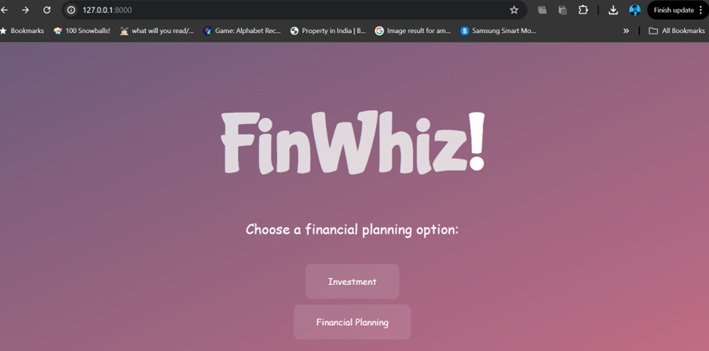

#  


<h1>FinWhiz


Welcome to FinWhiz! A web-based platform that provides personalized financial planning and investment recommendations to users.

🚀 Introduction

You know how it’s sometimes YOLO and sometimes where is my life even heading? FinWhiz finds a middle space and helps you get to touch grass and plan if necessary. It aims to simplify the finance sector and make it easy for everyone. Yield instantly what you are looking for right now.



This is the index page of our application which lets you select between the two options


🌟 Features

->📝 Financial Planning Page
A comprehensive page that allows users to input their financial information, including age, salary, and financial goals.


->📈 Investment Page
A page that provides users with personalized investment recommendations, divided into sectors such as stocks, bonds, and mutual funds.


->🎯 Goal-Based Investing
Users can set specific financial goals, such as retirement or buying a house, and the platform will provide recommendations on how to achieve them.


->📊 Risk Profiling
The platform assesses the user's risk tolerance and provides investment recommendations accordingly.


->🧩 Portfolio Allocation
The platform provides a suggested portfolio allocation based on the user's investment goals and risk tolerance.

We have taken our data from financial times real-time live data to generate the desired result

🛠 Getting Started
Prerequisites
- Python 3.8 or higher
- Django 3.2 or higher
- MySQL or PostgreSQL database and more in requirements.txt

Installation
1. **Clone the repository:**
    ```bash
    git clone https://github.com/Jan2777/finwhiz.git
    ```
2. **Install dependencies:**
    ```bash
    pip install -r requirements.txt
    ```
3. **Create a database:**
    ```bash
    python manage.py migrate
    ```
4. **Run the development server:**
    ```bash
    python manage.py runserver
    ```

---

🌐 Deployment

FinWhiz can be deployed on a cloud platform such as AWS or Google Cloud, or on a dedicated server. It can also be easily integrated into an existing bank profile platform and chatbots, providing real-time analysis and personalized recommendations.

🤝 Contributing

Contributions are welcome! If you'd like to contribute to FinWhiz, please fork the repository and submit a pull request.

🚧 Roadmap

- **Machine Learning Integration:** Integrate machine learning algorithms to provide more accurate and personalized investment recommendations.
- **Real-Time Market Data:** Integrate real-time market data to provide users with up-to-date information on market trends and investment opportunities.
- **Mobile App Development:** Develop a mobile app for FinWhiz, allowing users to access financial planning and investment advice on-the-go.

📸 Screenshots

### Financial Planning Page


### Financial Planning Result


### Investment Page


### Investment Result

 
and the suggested one's global equity indices graph gets displayed in the end

Thank youuu ×͜×

